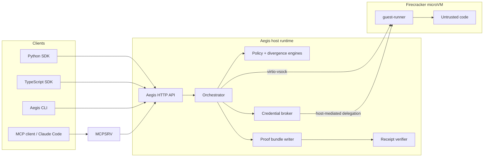

# Aegis

**Aegis is an execution evidence platform — run untrusted code in hardware-isolated sandboxes and get cryptographic proof of what happened.**

Aegis is built for code you should not trust with your host: agent-generated tools, brokered upstream access, and execution flows that need evidence, not just logs. It combines Firecracker microVM isolation, policy-governed runtime controls, and cryptographic receipts you can verify after execution.

## Start Here

- [Canonical Demo](docs/canonical-demo.md)
- [Quickstart](docs/quickstart.md)
- [Proof Pipeline](docs/proof-pipeline.md)
- [Security Posture](SECURITY.md)

## Why It Exists

Running untrusted code is not just a sandboxing problem.

You need:

- a real isolation boundary between host and guest
- explicit policy on files, network, process behavior, and delegated capabilities
- secret-safe access to upstream systems without handing raw credentials to guest code
- verifiable evidence of what ran, what was denied, and what the runtime observed

Aegis is the system for that shape of problem.

## Run This First

```bash
python3 scripts/run_canonical_demo.py --serve
```

That is the shortest serious product proof in this repo. It shows:

- an allowed governed action
- a denied direct egress attempt
- receipt verification proving both outcomes

If you need first-run host setup instead of the product demo path, start with [Quickstart](docs/quickstart.md).

## What This Is

- a self-hosted execution evidence runtime
- Firecracker-backed isolation for untrusted code
- policy-governed external action instead of raw guest freedom
- proof bundles and receipts that can be verified after execution
- a local operator flow exposed through CLI, HTTP API, SDKs, and MCP

## What This Is Not

- not a package-only install story
- not a hosted multi-tenant platform
- not host attestation
- not HSM/KMS-backed signing custody
- not a generic dev sandbox with nicer branding

## Source Checkout Quickstart

For a source checkout, the primary onboarding path is:

1. install host prerequisites
2. `aegis setup`
3. `aegis doctor`
4. `aegis serve`
5. run one SDK example
6. `aegis receipt verify`

The shortest honest version is:

```bash
# optional automation only; not the primary truth surface
bash scripts/install.sh

aegis setup
aegis doctor
aegis serve
```

In a second shell, source-tree Python mode:

```bash
cd sdk/python
# Debian/Ubuntu: install python3-venv and python3-pip first if needed
python3 -m venv .venv
. .venv/bin/activate
pip install -e .
python examples/run_code.py
```

Then verify the proof bundle printed by the example:

```bash
aegis receipt verify --proof-dir /path/to/proof-dir
```

That path gives you:

- a Firecracker-backed execution
- a proof bundle on disk
- a signed receipt
- a verification result against the emitted proof

For the full source-checkout path, caveats, and TypeScript source-tree mode, start with [docs/quickstart.md](docs/quickstart.md).

## Distribution Posture

Use Aegis through one of these paths:

### Primary public path

Source checkout on Linux/KVM with release assets.

This is the primary supported public path today.

### Secondary public path

Consume the Python or TypeScript SDK packages against an already running Aegis runtime.

### Not-primary

These are not honest primary claims today:

- `pip install aegis-sdk` and you are done
- `npm install @aegis/sdk` and you are done
- package-only usage that also bootstraps Firecracker, rootfs assets, database setup, and runtime readiness

The SDKs are client packages for a running Aegis runtime. They are not the runtime distribution story by themselves.

Current repo-coupled SDK version posture:

- Python SDK version `0.1.0`
- TypeScript SDK version `0.1.0`

## Release Assets And Checksums

The source-checkout runtime path expects these release artifacts:

- `firecracker`
- `vmlinux`
- `alpine-base.ext4`

Checksum contract:

- `scripts/release-checksums.txt`

`scripts/install.sh` is optional automation. It is not the primary truth surface. The primary truth surfaces remain:

- `aegis setup`
- `aegis doctor`
- `aegis serve`
- `aegis receipt verify`

## What Aegis gives you

- **Hardware-isolated execution** with Firecracker microVMs and a separate guest kernel
- **Policy-governed runtime behavior** across file access, network, process scope, and time/resource budgets
- **Divergence handling** with explicit receipts for allow, warn, deny, and enforcement outcomes
- **Brokered secret-safe delegation** over vsock, including allowed and denied credential paths without raw secret exposure to guest code
- **Cryptographic receipts and proof bundles** that can be verified after execution
- **Operator-usable local runtime** with `aegis setup`, `aegis serve`, readiness reporting, and honest posture output
- **Developer-facing integrations** through Python SDK v1, TypeScript SDK v1, and MCP wrapper v1
- **Warm pool v1** for lower startup latency on the supported warm-path request shapes

## Architecture



Trust boundaries:

- host and guest are separated by a Firecracker microVM boundary
- secrets stay on the host side and are exposed only through the broker policy surface
- receipts and proof bundles are produced on the host after execution telemetry is collected
- verification is separate from execution so downstream systems can validate what happened

More detail: [docs/architecture.md](docs/architecture.md)

## When to use Aegis

- you need an auditable path for untrusted agent or tool execution
- you need evidence or provenance for what code did at runtime
- you need to constrain file, process, network, and delegation behavior with explicit policy
- you need upstream access through a broker without giving the guest raw credentials
- you need a self-hosted local runtime that can also be reached through SDKs or MCP

## When not to use Aegis

- you only need a casual local dev sandbox
- a plain container, devcontainer, or process sandbox is already sufficient
- you are optimizing for ultra-low-latency, very high-volume execution where the current evidence-producing model is too heavy
- you require host attestation, HSM/KMS-backed signing custody, or enterprise multi-tenant trust guarantees today

## Status and maturity

**Launch-quality with caveats.**

Strong enough to evaluate now:

- Firecracker runtime with policy enforcement, telemetry, divergence handling, and proof generation
- brokered credential delegation with validated allowed and denied paths
- operator flow through `aegis setup` and `aegis serve`
- Python SDK v1, TypeScript SDK v1, and MCP wrapper v1
- verified receipt and proof-bundle workflow
- warm pool v1 for default-profile scratch executions

Still intentionally scoped:

- warm coverage is not universal across all profile and workspace shapes
- signing is local/self-hosted, not HSM/KMS-backed
- no host attestation
- not positioned as a hardened hosted multi-tenant control plane

Not built yet:

- host attestation
- HSM/KMS-backed receipt-signing custody
- broader multi-tenant orchestration
- alternate runtime backends such as gVisor

## Documentation index

- [docs/quickstart.md](docs/quickstart.md): canonical source-checkout onboarding path
- [docs/architecture.md](docs/architecture.md): component model and trust boundaries
- [docs/api.md](docs/api.md): HTTP API behavior and examples
- [docs/openapi.json](docs/openapi.json): OpenAPI description of the current HTTP surface
- [docs/mcp_server.md](docs/mcp_server.md): MCP server tools, schema, and client setup
- [docs/canonical-demo.md](docs/canonical-demo.md): canonical product demo command, proof claims, and optional add-ons
- [docs/warm_pool.md](docs/warm_pool.md): warm pool v1 behavior, observability, and caveats
- [SECURITY.md](SECURITY.md): security model, threat model, limitations, and disclosure guidance
- [sdk/python/README.md](sdk/python/README.md): Python SDK reference
- [sdk/typescript/README.md](sdk/typescript/README.md): TypeScript SDK reference

## Example usage

### Python SDK: execute and verify

```python
from aegis import AegisClient

client = AegisClient()
result = client.run(language="bash", code="echo proof-demo")
print(result.stdout.strip())

verification = result.verify_receipt()
print(verification.verified, verification.execution_id)
```

For a stronger second-step proof after first success, run:

```bash
python3 scripts/run_canonical_demo.py --serve
```

That is the canonical product demo path, not the first-run onboarding path. See [docs/canonical-demo.md](docs/canonical-demo.md).

### MCP: isolated execution tool

Once the MCP server is registered, clients call:

- `aegis_execute` to run code through the existing Aegis runtime
- `aegis_verify` to validate a prior proof bundle

The MCP wrapper stays intentionally thin. It does not bypass the HTTP API or the receipt-verification path. See [docs/mcp_server.md](docs/mcp_server.md).

## Comparison

These systems are not identical categories.

Aegis is optimized for **evidence-producing isolated execution**. Some alternatives are managed cloud sandboxes, some are local sandbox products, and some are agent orchestration platforms first.

| Capability | Aegis | E2B | Docker Sandboxes | Managed agents |
| --- | --- | --- | --- | --- |
| Primary focus | Execution evidence and isolated code execution | Managed cloud sandbox runtime | Local sandbox environments for agents and tools | Agent orchestration and hosted tool use |
| Hardware-isolated execution | Yes, Firecracker microVMs | Varies by platform details; public docs position it as an isolated cloud sandbox | VM-backed/local sandbox environments per Docker sandbox docs | Varies; not the primary category contract |
| Cryptographic execution receipts | Yes | Not a primary product surface | Not a primary product surface | Not a primary product surface |
| Brokered secret-safe delegation | Yes | Varies | Varies | Varies by platform and tool model |
| Self-hosted local runtime | Yes | No, managed cloud default | Yes | No, managed by provider |
| MCP integration | Yes | Varies | Varies | Varies |
| Warm-path startup optimization | Yes, warm pool v1 | Varies | Varies | Provider-managed and product-specific |

The point of comparison is not “Aegis replaces every sandbox or agent platform.” The point is that Aegis is unusually centered on **verifiable isolated execution with proof artifacts** rather than sandboxing or agent orchestration alone.
