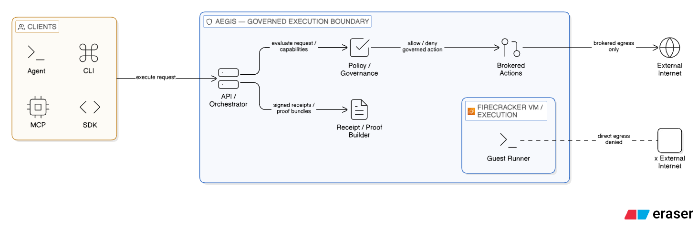

# Architecture

Aegis is a host-operated governed execution runtime. The current system is intentionally narrow: one Linux host, one Firecracker/KVM execution boundary, a small set of governed side-effect paths, and signed receipts plus offline verification.

## System View

  

## End-To-End Flow

### 1. Admission

The host API receives an execution request and derives the frozen execution boundary:

- `policy_digest`
- `authority_digest`
- broker action types
- broker repo labels
- approval mode
- workload identity inputs used later by lease issuance

This happens before VM start.

If the frozen authority includes lease-covered side-effect classes, Lease V1 must be issued and persisted before the execution is allowed to start.

Current lease-covered classes:

- `http_request`
- `host_repo_apply_patch`

### 2. Firecracker execution

The host starts a Firecracker microVM and launches `guest-runner` inside it.

The guest is treated as untrusted. It can execute code, emit stdout/stderr, and request governed side effects, but it is not the source of truth for policy, approval, or receipt generation.

### 3. Governed side-effect paths

The guest reaches the host only through the current explicit side-effect surfaces:

- brokered outbound HTTP
- typed `host_repo_apply_patch`

There is no generic host command runner.

For both current governed paths, the host-side order is:

1. canonicalize the exact request
2. evaluate policy
3. verify Lease V1
4. verify approval when required
5. atomically consume lease budget and approval use
6. perform the side effect
7. emit raw governed-action evidence

For `host_repo_apply_patch`, the host also performs repo resolution, precheck, target-scope enforcement, and local-host advisory locking before apply.

### 4. Telemetry and escalation

Runtime evidence is emitted on the host side:

- governed action allow/deny events
- host-action evidence
- approval and lease evidence
- escalation evidence
- runtime-policy summary inputs

Escalation summary is derived from raw evidence rather than being authored independently by scattered call sites.

### 5. Receipt build and proof bundle

At the end of a started execution, the host builds:

- a DSSE-signed receipt
- a proof bundle directory
- a convenience text summary

The receipt binds:

- authority and digests
- runtime result
- governed action evidence
- approval / lease / host-action evidence
- escalation summary
- signed artifact hashes

### 6. Offline verification

`aegis receipt verify --proof-dir ...` re-checks:

- DSSE signature
- artifact hashes
- receipt schema and semantic invariants
- summary consistency rules for the current receipt format

Verification is offline proof checking. It is not attestation.

## Current Components

### API / CLI / SDK surface

Current operator and integration entrypoints include:

- HTTP API
- `aegis` CLI
- Python and TypeScript SDKs
- MCP wrapper

### Broker

The broker is the host-side side-effect control point.

Today it supports:

- brokered outbound HTTP
- `host_repo_apply_patch`

Everything else is denied or unsupported.

### Lease V1

Lease V1 is a short-lived standing authority object bound to:

- execution ID
- workload identity
- `policy_digest`
- `authority_digest`
- allowed action kinds through grants
- coarse resource selectors
- count budgets

It is broker-local, not guest-visible.

### Approval tickets

Approval tickets are separate from leases.

- Lease: coarse standing authority for a class of side effects
- Approval ticket: exact per-attempt consent for a specific request resource

`host_repo_apply_patch` always requires approval.
Brokered HTTP requires approval when the selected mode is `require_host_consent`.

### Receipts and proof bundles

Receipts are the signed record.
Proof bundles are the on-disk verification package.
The text summary is operator convenience only; it is not the signed source of truth.

## Trust Boundaries

### Client to host

Clients trust the host runtime to enforce the configured policy and to produce proof artifacts that can later be verified.

### Host to guest

The host/guest boundary is the Firecracker microVM boundary plus virtio-vsock communication.

### Host broker to upstream

The broker remains on the host side. The guest requests actions; it does not receive raw host-side approval or receipt signing secrets.

### Signer to verifier

Verification checks host-produced artifacts. It does not remove the host from the trust base.

## Boundaries Aegis Does Not Claim

Aegis does not currently claim:

- hardware attestation
- trustlessness
- hostile-host independence
- production-ready multi-tenant public-cloud control-plane semantics
- arbitrary busy shared-repo safety for host patching

For trust assumptions, use [trust-model.md](trust-model.md).
For receipt fields and proof semantics, use [receipt-schema.md](receipt-schema.md).
